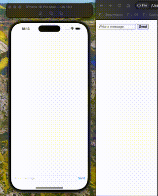

# WebSocketChat
This repository contains a sample client-server apllication.  Server is a dockerized websocket implemented in javascript with NodeJS and client iOS application that feteches data from server. 

This repository serves as the foundational code for the accompanying blog post.[Websockets Made Easy: Create a simple Chat App in iOS](https://javios.eu/swift/websockets-made-easy-create-a-simple-chat-app-in-ios/)

## 🎥 Demo Video

### Check out the app in action!  
  

## Requirements

- **Xcode 15.0 or later**
- **iOS 16.0 or later**
- **Swift 6.0**

